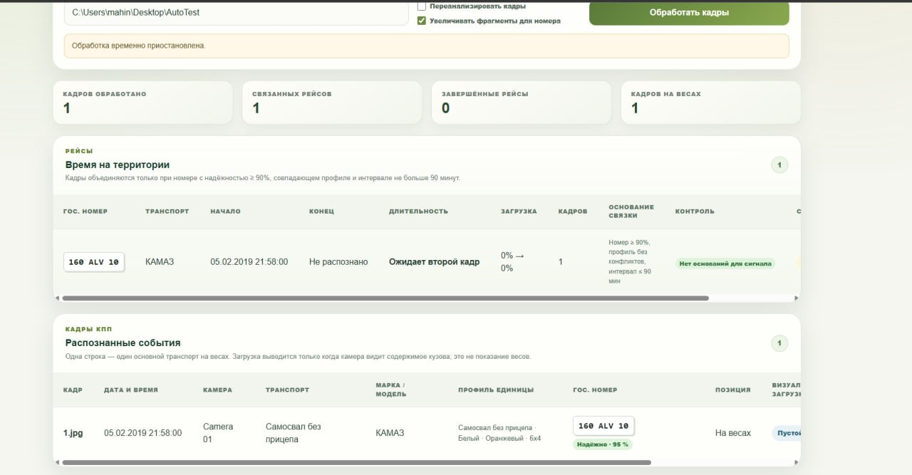
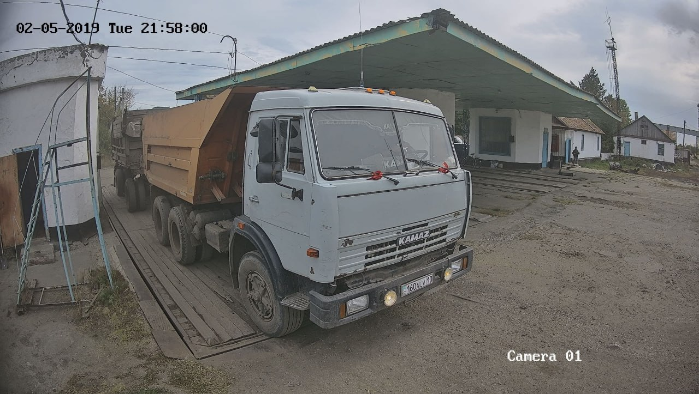

# ErgoDrive · Checkpoint Intelligence

**ErgoDrive** — интеллектуальная система контроля въезда и загрузки транспорта для агропромышленных и логистических комплексов. Проект разработан в рамках **AgroTech Hackathon 2026** и использует Vision AI для автоматического анализа транспорта на КПП.

## Возможности

- **Vision AI-анализ** кадров с камер КПП
- **Распознавание транспорта**: госномер, марка, цвет, количество осей (по мере возможности, зависит от фото)
- **Оценка загрузки** кузова в процентах
- **Трекинг рейсов** и времени пребывания транспорта
- **Выявление рисков и аномалий**
- **Telegram-уведомления** о событиях
- **Экспорт данных** в JSON и CSV

## Технологии

- **.NET 10**
- **Blazor Server**
- **Entity Framework Core + SQLite**
- **Groq API / Vision AI**
- **Qwen**
- **Telegram Bot API**

## Запуск

```bash
dotnet restore
dotnet build
dotnet run
```

После запуска укажите папку с тестовыми кадрами в интерфейсе приложения.

Для Telegram-уведомлений укажите **Chat ID** и предварительно нажмите **Start** у бота. (@ergodrivebot)

## Как работает

```text
Кадр с КПП
↓
Vision AI
↓
Распознавание транспорта
↓
Оценка загрузки и рисков
↓
Трекинг рейса
↓
База данных + Telegram + Export
```





## Цель проекта

Автоматизировать контроль транспорта на КПП и предоставить оператору единую картину: **кто въехал, что перевозит, насколько загружен и какие события требуют внимания**.

Все токены тестовые, можете использовать и тестить.
